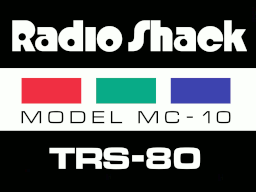
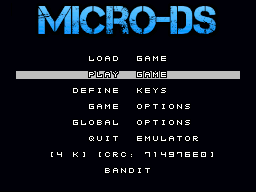
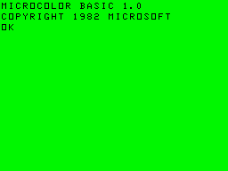
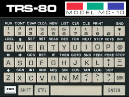
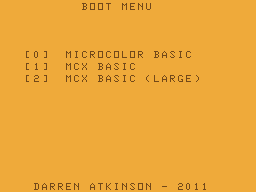

# MicroDS
A Tandy MC-10 Micro Color Computer emulator for the DS/DSi/XL/LL

The Tandy MC-10 computer was produced starting in 1983 and discontinued only a year later. With only 4K of RAM (plus a 16K RAM expansion available), it was designed
to compete with entry-level machines of the era. It had the same Video Display Graphics (VDG) chip of the Tandy CoCo line and a similar (but not exact) CPU, it is 
often looked at as the 'little brother' (sadly, sometimes the 'red-headed step-child') of the CoCo 1/2.  The machine found itself a bit too underpowered in a world 
where more capable machines were coming down in prices quickly. It's unknown how many of these little machines were sold, but it is unlikely there are more than 
250,000 of these floating about.



Features :
-----------------------
* Tandy MicroColor Computer MC-10 emulation with solid MC6803 CPU core.
* 4K Internal RAM + 16K External Expansion RAM for 20K total (+128 byte CPU RAM).
* Optional memory expansion to 32K in machine configuration.
* Cassette (.c10) support for loading games and programs.
* Save/Load Game State (one slot).
* LCD Screen Swap (press and hold L+R+X during gameplay).
* LCD Screen snapshot - (press and hold L+R+Y during gameplay and the .png file will be written to the SD card).
* Virtual keyboard stylized to the MC-10 with the ability to map any keyboard key to DS buttons.
* Full speed, full sound and full frame-rate even on older hardware.

Copyright :  
-----------------------
MicroDS is Copyright (c) 2025 Dave Bernazzani (wavemotion-dave)

This is a derivative work of Dragon 32 Emu Copyright (c) 2018 Eyal Abraham (eyalabraham)
which can be found on github:

https://github.com/eyalabraham/dragon32-emu

The dragon32-emu graciously allows modification and use via the lenient MIT Licence.

As far as I'm concerned: as long as there is no commercial use (i.e. no profit is made),
copying and distribution of this emulator, it's source code and associated readme files,
with or without modification, are permitted in any medium without royalty provided this 
copyright notice is used and wavemotion-dave and eyalabraham are thanked profusely.

Royalty Free Music for the opening jingle provided by Anvish Parker

lzav compression (for save states) is Copyright (c) 2023-2025 Aleksey 
Vaneev and used by permission of the generous MIT license.

The MicroDS emulator is offered as-is, without any warranty.

Credits :
-----------------------
I'd like to thank Mike Tinnes for his efforts on the MC-10 Javascript emulator (https://github.com/mtinnes/mc-10)
which I used a sort of reference point when I couldn't find the details I needed in the official documentation.

And also Eyal Abraham (eyalabraham) for his work on the dragon-emu which was a nice clean codebase to start with
so I didn't have to re-invent the wheel for the core.

BIOS/BASIC Files Needed :
-----------------------

You will need the MICROBASIC ROM which must be named either MC10.BIN or MC10.ROM (CRC32 of 11fda97e -- same file, just 
different naming conventions) and it must be placed in the same directory as the emulator or else /roms/bios

Optionally you can include MCX.BIN or MCX.ROM (CRC32 of 11202e4b) for MCX-128 emulation.

Loading Games :
-----------------------
This MC-10 emulator supports .C10 cassette files. These are the most popular format to find on the web for the MC-10 machine.



Games/Programs come in two main varieties: BASIC and Machine Language. Each requires a different LOAD command in MICROBASIC. 
The emulator tries to take a 'best guess' as to what kind of program is being loaded and is generally 95% accurate... but you 
can override this on a per-game configuration basis.

Loading a machine code language program vs a BASIC program:

```
CLOADM
EXEC

CLOAD
RUN
```

You can press the START button to automatically issue the load command once you've gotten to the main MICROBASIC screen:




Configuration Options :
-----------------------
MicroDS includes global options (applied to the emulator as a whole and all games) and game-specific options (applied to just the one game file that was loaded).

Key Mapping Options :
-----------------------
Each game can individually configure any of the 10 DS buttons (D-PAD, ABXY, L/R) to a single keyboard button. The default is for the D-PAD 
and Button A to replicate the Cursors (AWSX) but you can configure as you like. Pressing the X button on this screen will toggle between some preset defaults for common key
maps - such as WASD.

The START key is special - it will issue the CLOAD/CLOADM command to save typing.
The SELECT key is special - it issues the RUN command to MICROBASIC to save typing.

Keyboards :
-----------------------
The emulator supports a virtual touch-screen version of the MC-10 keyboard. Note that due to the limitations of the DS touch-screen where only one key can be
pressed at a time, the SHIFT key works like a temporary toggle. Press it and then the next key you press will be SHIFT-ed.



Screenshot and Screen Swap:
-----------------------
Pressing and holding the L/R shoulder buttons plus X will exchange the top and bottom screens. However, only the bottom screen is touch-sensitive so you would still need to press on the bottom screen to make the touch screen work.

Pressing and holding the L/R shoulder buttons plus Y will create a screen snapshot of the game screen. It will be time/date stamped and written to the SD card in the same directory as the game file.

MCX-128 and MCXBASIC:
-----------------------
If you have provided the 16K MCX.BIN external ROM (2.1 from Darren Atkinson released in 2011), you can run in MCX-128 mode. For any game that needs it, go into configuration for that game and select the machine type of "MCX-128".



The more useful menu item here is (1) MCX BASIC which provides the extended BASIC command set with the 32K memory model.  While the (2) MCX BASIC - LARGE model will work, it runs slowly due to having to swap banks in/out of memory
and the emulation is not designed for such activities and so the bytes must be moved in large blocks which taxes the emulation on the little DS handheld.

Known Issues:
-----------------------
* Frames are drawn in their entirety on the VSYNC meaning that any demos that utilize split-screen techniques will not run correctly. Virtually nothing tries to actually do this to the best of my knowledge.

Compile Instructions :
-----------------------
gcc (Ubuntu 11.3.0-1ubuntu1~22.04) 11.3.0
libnds 1.8.2-1
I use Ubuntu and the Pacman repositories (devkitpro-pacman version 6.0.1-7).  I'm told it should also build under 
Windows but I've never done it and don't know how.

If you've got the nds libraries above setup correctly it should be a matter of typing:
* _make clean_
* _make_

To build the emulator. The output of this is ColecoDS.nds with a version as set in the MAKEFILE.
I use the following standard environment variables that are SET on Ubuntu:
* DEVKITARM=/opt/devkitpro/devkitARM
* DEVKITPPC=/opt/devkitpro/devkitPPC
* DEVKITPRO=/opt/devkitpro

To create the soundbank.bin and soundbank.h (sound effects) file in the data directory:

mmutil -osoundbank.bin -hsoundbank.h -d *.wav

And then move the soundbank.h file to the arm9/sources directory

Versions :
-----------------------
0.8: 17-Aug-2024 by wavemotion-dave
* Fix for SG6 graphics when character index is > 128
* A subset of 'common' 6803 undocumented instructions added.
* START issues CLOAD/CLOADM and SELECT issues the RUN command.
* Cleanup of configuration and key map handling.
* Removed partial MCX support until a better plan can be had.

0.7: 15-Aug-2024 - First public beta.
